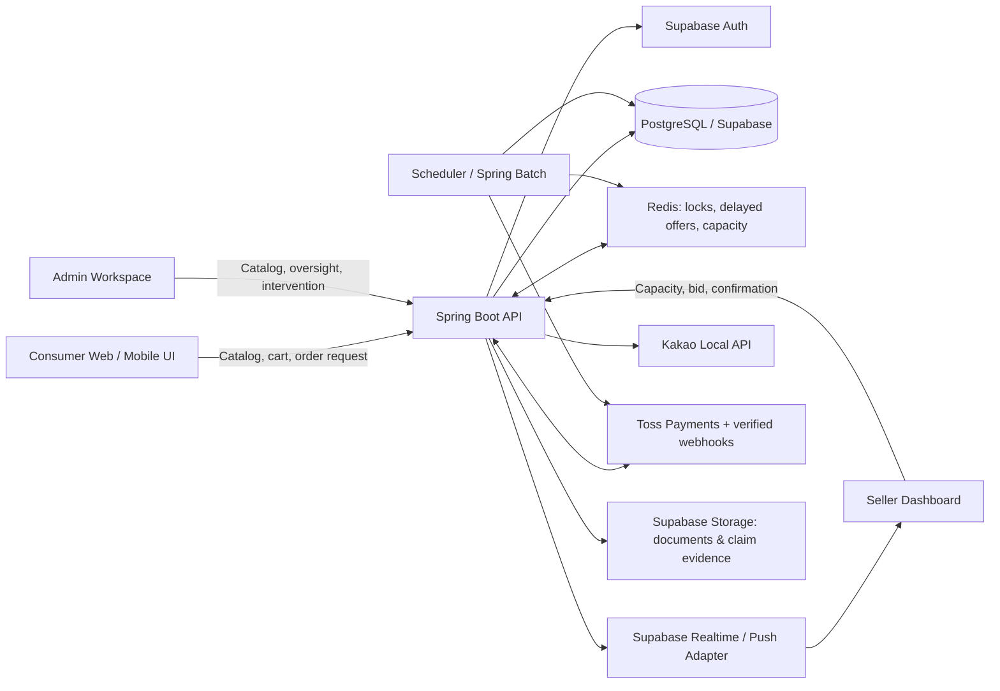

# 철수야 (Chulsoo-ya)

> **소비자 장바구니를 하나의 책임 있는 지역 판매자 매칭으로 연결하는 초지역적 철물 커머스 플랫폼**

[](README.md) [](#)

**철수야**는 일반 소비자, 기업 구매 담당자, 관공서 발주 담당자, 지역 철물점을 연결하는 O2O 플랫폼입니다. 소비자는 운영자가 관리하는 통합 상품 카탈로그에서 필요한 품목을 장바구니에 담아 지역 기반 주문을 요청합니다. 동일 행정구역(`gu_code`)의 자격 있는 판매자에게 제어된 실시간 주문 제안이 전달되고, 한 판매자가 배정된 주문 단위를 책임지고 배달 또는 픽업으로 이행합니다.

---

## 1. 모든 구현의 기준이 되는 제품 규칙

| 규칙 | 제품 의사결정 | 구현상 결과 |
| :--- | :--- | :--- |
| **카탈로그 소유권** | 상품, 가격, 카테고리, 이미지는 운영자가 중앙에서 관리합니다. 판매자는 매장별 재고를 사전 등록하지 않습니다. | 소비자 카탈로그 API와 판매자 가용량·응찰 API를 분리합니다. |
| **낙찰 판매자의 납품 책임** | 판매자는 응찰한 주문 단위의 전체 품목을 이행해야 합니다. 배정 품목 중 일부만 응찰하는 부분 응찰은 허용하지 않습니다. | 낙찰 응찰은 전체 배정 주문 단위에 대해서만 생성합니다. 향후 분할 주문 정책이 필요하면 응찰 전 별도 주문 단위를 생성합니다. |
| **지역 자격 조건** | 매칭은 배달 또는 픽업 지역의 `gu_code`를 기준으로 제한합니다. | 주문이 매칭 큐에 진입하기 전에 카카오 로컬 API로 주소를 정규화합니다. |
| **시간의 권위** | 매칭, 주문 제안, 물품 확인 마감 시간은 서버만 판정합니다. | 클라이언트 카운트다운은 시각 보조 도구일 뿐이며, 모든 API 액션은 서버 타임스탬프를 검증합니다. |
| **매칭 시간** | 주문은 최대 **5분** 동안 매칭을 대기합니다. 낙찰 판매자는 이후 **2분** 안에 물품 확보 가능 여부를 확인해야 합니다. | `match_deadline_at`, `seller_confirmation_deadline_at`을 주문에 저장하고, 마감 작업이 두 필드를 집행합니다. |
| **결제 순서** | 낙찰 판매자가 물품 확인을 완료한 뒤 결제를 진행하며, 결제가 성공하기 전에는 배달 또는 픽업을 시작할 수 없습니다. | 주문·결제·정산 상태 머신을 분리합니다. 향후 사전승인을 도입하더라도 PG사 상태를 별도 관리하며 `PAID`와 혼용하지 않습니다. |
| **클레임 보호** | 반품, 교환, 부분 교체 요청은 관련 정산 대금을 보류합니다. | 클레임 생성 트랜잭션에서 정산을 `HOLD`로 전환하고, 변경 불가능한 클레임 타임라인을 남깁니다. |

---

## 2. 서비스 역할과 핵심 여정

| 역할 | 핵심 목표 | 핵심 여정 |
| :--- | :--- | :--- |
| **소비자** | 여러 매장에 전화하지 않고 필요한 철물 품목을 찾습니다. | 주소 설정 → 카탈로그 탐색 → 장바구니 관리 → 주문 요청 → 매칭 대기 → 판매자 확인 후 결제 → 배달/픽업 추적 → 리뷰 또는 클레임. |
| **기업/관공서 구매자** | 증빙 가능한 구매 주문을 처리합니다. | 소비자 흐름에 기관·서류 정보를 더하고, 권한에 따라 견적서·거래명세서·세금계산서·영수증을 다운로드합니다. |
| **판매자** | 감당 가능한 수준의 지역 수요만 수신합니다. | 가용 처리 수량 설정 → 시간 제한 주문 제안 수신 → 응찰 → 2분 내 물품 확인 → 이행 → 서류·클레임·성과 관리. |
| **운영자** | 카탈로그 품질, 판매자 검증, 플랫폼 신뢰도를 관리합니다. | 카탈로그 관리 → 판매자 검증 → 매칭/가용량 모니터링 → 클레임 중재 → 패널티·정산·쿠폰·리포트 관리. |

---

## 3. 프론트엔드 정보 구조와 UI/UX 레이아웃

프론트엔드는 긴급 철물 구매와 판매자의 빠른 응찰을 고려하여 **모바일 우선**으로 설계합니다. 데스크톱은 동일한 콘텐츠 우선순위를 유지한 채 내비게이션과 다중 패널을 확장하며, 비즈니스 흐름 자체를 별도로 만들지 않습니다.

### 3.1 공통 디자인 시스템

| 요소 | 적용 원칙 |
| :--- | :--- |
| **시각 방향성** | 차분한 뉴트럴 배경에 절제된 파스텔 포인트를 사용합니다. 신뢰도, 가용성, 마감 상태는 장식 이미지보다 항상 더 뚜렷하게 보여야 합니다. |
| **색상 의미** | 핵심 액션: 파랑, 가능/성공: 초록, 대기/마감 임박: 주황·황색, 실패/제한/위험: 빨강. 상태를 색상만으로 전달하지 않습니다. |
| **타이포그래피와 밀도** | 한글 최적화 산세리프 스택, 모바일 본문 기준 16px 이상, 짧고 명확한 액션 레이블을 사용합니다. 가격·수량·시간 제한은 가능한 한 표형 숫자로 표시합니다. |
| **반응형 기준** | 모바일: 1열 콘텐츠와 고정 하단 내비게이션, 태블릿: 유용한 경우 2열, 데스크톱: 지속형 사이드 내비게이션 또는 다중 패널 대시보드. |
| **접근성** | 키보드 조작, 명확한 포커스, 아이콘 버튼의 텍스트 레이블, 입력 필드와 연결된 오류 메시지, 의미론적 헤딩, 모바일 최소 44 × 44px 터치 영역을 적용합니다. |
| **실시간 피드백** | 연결 상태, 요청 진행, 마감, 성공, 실패, 재시도 가능 상태를 명확히 표시합니다. 응찰·결제·클레임은 서버 확인 전 성공처럼 표현하지 않습니다. |

### 3.2 소비자 메인 페이지

메인 페이지는 소비자가 위치 설정부터 유효한 장바구니 구성까지 가장 빠르게 진행하는 출발점입니다. 상품 카탈로그가 중앙 관리되고 매장 재고는 판매자 응찰 시점에 확인되므로, 화면은 판매자를 일반적인 재고 보유 상품 목록처럼 보여주지 않습니다.

| 레이아웃 영역 | 데스크톱 구성 | 모바일 구성 | 필수 상호작용 |
| :--- | :--- | :--- | :--- |
| **글로벌 헤더** | 브랜드, 주소 선택, 카탈로그 검색, 장바구니 배지, 인증/프로필 액션을 배치합니다. | 브랜드·주소·장바구니 중심의 압축 바를 사용하고 검색은 전용 입력 화면 또는 시트로 엽니다. | 주소 변경 시 결제 진행 허용 전 `gu_code`를 갱신합니다. |
| **히어로 / 주문 진입부** | 서비스 가치 제안, 눈에 띄는 카탈로그 검색, 위치 확인 패널을 넓게 배치합니다. | 동일한 검색·위치 제어를 상단 카드에 배치하며, 주문을 지연시키는 과도한 장식 블록은 두지 않습니다. | 검색은 카탈로그 결과로 이동하며, 위치 요청에는 권한·직접 입력·오류 상태가 모두 있어야 합니다. |
| **카테고리 탐색** | 히어로 아래에 가로 카테고리 스트립 또는 그리드를 둡니다. | 가로 스와이프 칩 또는 2~4열 아이콘 그리드를 사용합니다. | 카테고리 선택 시 현재 지역을 유지한 필터 결과로 이동합니다. |
| **상품 탐색** | 이미지, 상품명, 규격 요약, 가격, 수량 제어, 장바구니 추가 액션을 포함한 반응형 카드 그리드입니다. | 2열 카드 그리드를 사용하고 수량 변경은 의도적이고 읽기 쉽게 처리합니다. | 장바구니 추가는 즉시 피드백을 제공하며 고정 장바구니 배지를 갱신합니다. |
| **주문 신뢰 패널** | 요청 → 지역 판매자 매칭 → 판매자 물품 확인 → 결제 → 배달/픽업 순서를 설명합니다. | 핵심 탐색 영역 아래에 3단계 요약 패널을 둡니다. | 매칭 정책과 주문 안내로 연결합니다. |
| **푸터** | 서비스 내비게이션, 정책 링크, 운영팀이 제공하는 고객지원·법적 정보를 배치합니다. | 하단 내비게이션 위에 접을 수 있는 링크로 구성합니다. | 장바구니 또는 결제 CTA와 경쟁하지 않아야 합니다. |

**소비자 하단 내비게이션:** `홈` · `카테고리` · `장바구니` · `주문내역` · `마이`.

### 3.3 소비자 거래 화면

| 화면 | 필수 UI 요소 | 반드시 지켜야 할 동작 |
| :--- | :--- | :--- |
| **카탈로그 / 검색 결과** | 검색창, 카테고리·규격 필터, 정렬, 상품 카드, 빈 결과 상태. | 카탈로그 가용성을 매장별 실시간 재고처럼 표시하지 않습니다. |
| **상품 상세** | 상품 이미지, 표준화된 상세 정보, 가격, 수량 선택, 연관 카테고리, 장바구니 CTA. | 수량 변경은 장바구니 상태를 안전하게 갱신하고 검증 피드백을 표시합니다. |
| **장바구니** | 수정 가능한 품목, 소계, 배달/픽업 선택, 주소, 쿠폰 선택, 서류 프로필, `매칭 요청` CTA. | 주소·수량·필수 구매자 정보가 유효하기 전에는 주문 요청을 차단합니다. |
| **매칭 대기** | 서버 동기화 5분 카운트다운, 매칭 상태, 배달/픽업 방식, 도움 경로. | 새로고침 후에도 서버 타임스탬프 기준으로 복원되며 기기 시간으로 초기화되지 않습니다. |
| **판매자 확인 대기** | 판매자가 주문을 수락했음을 알리고 남은 물품 확인 시간을 표시합니다. | 거절 또는 시간 초과 시 가속 재입찰 또는 `MATCH_FAILED` 안내로 전이하며 허위 성공 메시지를 표시하지 않습니다. |
| **결제** | 최종 주문 요약, 결제 수단, 쿠폰 반영 금액, 동의, 결제 진행 상태. | 판매자 확인 완료 후에만 결제를 시작하며, 멱등성 키로 중복 제출을 방지합니다. |
| **주문 상세 / 클레임** | 이행 타임라인, 서류 링크, 클레임 CTA, 증빙 업로드, 클레임 이력. | 클레임 접수 전 정산 보류 효과를 설명하고, 서버가 확정한 상태만 표시합니다. |

### 3.4 판매자 대시보드

판매자 대시보드는 마케팅성 콘텐츠보다 운영 제어를 우선합니다. 첫 화면은 반드시 다음 질문에 답해야 합니다. **지금 주문을 받을 수 있는가, 무엇을 먼저 처리해야 하는가?**

| 대시보드 영역 | 필수 콘텐츠 | 상호작용 규칙 |
| :--- | :--- | :--- |
| **가용성 명령 바** | 주문 수신 상태, 설정 가용량, `예약 + 진행 / 설정` 슬롯 사용량, 잔여 수량, 원터치 **바쁨 모드**. | 바쁨 모드는 서버 확인을 거쳐 설정 가용량을 즉시 `0`으로 변경합니다. |
| **빠른 슬롯 제어** | 가용 수량 슬라이더 또는 스테퍼. 등급별 한도는 프리미엄 `1~15`, 일반 `1~8`, 무료/신규 `1~3`. | 모든 변경은 `StoreSlotSettingsLog`를 남기며, UI는 대기·오류·완료 상태를 보여줍니다. |
| **실시간 주문 제안 큐** | 그룹화된 신규 주문 제안, 만료 카운트다운, 주문 단위 요약, 배달/픽업 정보, 응찰·거절 액션. | 만료 또는 다른 판매자의 낙찰 후 CTA를 비활성화합니다. 버튼이 아닌 서버만이 낙찰자를 판정합니다. |
| **물품 확인 작업 영역** | 낙찰 주문 상세, 2분 확인 카운트다운, 이행 방법, 물품 확인 완료·이행 불가 액션. | 실패 또는 지연 확인은 정의된 복구 및 패널티 경로를 실행합니다. |
| **진행 중 이행** | 준비 중, 배달/픽업 준비, 배달 중, 완료 주문 및 고객 보호 연락 수단. | 상태 변경은 주문 이벤트로 기록되며 유효한 상태 전이를 통과해야 합니다. |
| **클레임 및 서류** | 미확인 클레임 수, 클레임 빠른 처리, 정산 보류 상태, 서류 다운로드. | 환불·부분 재발송·회수 지시·거절은 서버 권한 검증과 감사 이벤트를 거쳐야 합니다. |
| **운영 인사이트** | 슬롯 포화 횟수, 놓친 주문 수, 응찰 반응 시간, 매칭 성공률, 납품 준수율. | 지표는 읽기 전용 파생값이며 클라이언트에서 수정할 수 없습니다. |

### 3.5 관리자 워크스페이스

관리자 화면은 지속형 좌측 내비게이션과 맥락 중심 메인 패널을 사용하는 데스크톱 우선 레이아웃으로 설계합니다. 카탈로그, 판매자 검증, 실시간 매칭, 가용량 강제 조정, 클레임, 정산, 쿠폰, 패널티, 감사 로그를 포괄해야 합니다. 판매자 상세 화면에는 슬롯 현황, 슬롯 변경 이력, 놓친 주문, 주문 생애주기 타임라인, 응답 속도, 클레임 발생률, 관리자의 가용량 0 강제 설정과 같은 권한 있는 조치가 포함됩니다.

### 3.6 필수 UI 상태

모든 라우트와 핵심 컴포넌트는 **로딩**, **빈 결과**, **오류**, **오프라인/재연결**, **권한 없음**, **만료**, **성공** 상태를 정의해야 합니다. 실시간 화면은 연결 상태와 마지막 서버 갱신 시각을 추가로 표시합니다. 비활성화된 액션은 사유를 설명해야 하며, 이유 없이 숨기지 않습니다.

---

## 4. 프론트엔드 모듈 경계

연결된 저장소의 현재 `client/src/App.tsx`는 기본 Vite 시작 화면이며 제품 UI가 아닙니다. 기능 개발 완료로 간주하기 전에 반드시 교체합니다.

```text
client/
└── src/
    ├── app/                 # 앱 셸, 라우팅, 프로바이더, 라우트 가드
    ├── components/          # 재사용 UI 프리미티브와 조합형 공통 컴포넌트
    ├── features/
    │   ├── catalog/         # 카테고리, 검색, 상품 상세
    │   ├── cart/            # 장바구니와 장바구니 품목 상태
    │   ├── checkout/        # 주소, 구매자 프로필, 매칭 요청, 결제
    │   ├── matching/        # 실시간 매칭과 마감 시간 UI
    │   ├── orders/          # 소비자 주문 추적과 클레임
    │   ├── seller/          # 가용량, 주문 제안, 확인, 이행, 지표
    │   └── admin/           # 카탈로그, 검증, 거버넌스, 리포트
    ├── services/            # 타입 안전 API 클라이언트, Supabase Realtime 어댑터, 인증 어댑터
    ├── hooks/               # 재사용 가능한 도메인 인지 훅
    ├── styles/              # 디자인 토큰, 전역 스타일, 반응형 유틸리티
    └── types/               # 공유 클라이언트 계약; 생성된 계약을 우선 사용
```

라우트 가드는 `CONSUMER`, `SELLER`, `ADMIN` 역할을 강제합니다. 비즈니스 판단은 서버에 두고, 프론트엔드는 확정된 상태를 렌더링하고 유효한 입력을 수집하며 승인된 실시간 이벤트를 구독합니다.

---

## 5. 백엔드 및 실시간 아키텍처



| 레이어 | 책임 |
| :--- | :--- |
| **React + TypeScript 클라이언트** | 역할별 UI, 반응형 레이아웃, 장바구니 상태, 서버 상태 렌더링, 실시간 구독. |
| **Spring Boot API** | 권한 검증, 도메인 상태 전이, 매칭 오케스트레이션, 결제·클레임 워크플로우, 감사 로그. |
| **PostgreSQL / Supabase** | 영속 트랜잭션 상태, 행 단위 접근 정책, 변경 불가능한 운영 이력. |
| **Redis** | 주문 단위 분산 락, 지연 주문 제안 발송, 가용량 예약, 멱등성·재시도 조정. |
| **Supabase Realtime / 푸시 어댑터** | 승인된 도메인 이벤트를 판매자·소비자 화면에 전달하며 진실 공급원이 되지 않습니다. |

---

## 6. 핵심 데이터 모델과 불변 조건

### 6.1 핵심 도메인

| 도메인 / 테이블 | 목적 | 필수 필드와 관계 |
| :--- | :--- | :--- |
| **Users** | 통합 인증과 역할 관리. | `id`, `email`, `role`, 프로필 필드. 역할: `CONSUMER`, `SELLER`, `ADMIN`. |
| **Stores** | 검증된 판매자 프로필과 매칭 자격. | `user_id`, `gu_code`, 검증 상태, 구독 등급, `tier_slot_cap`, `configured_slots`, `reserved_slots`, `active_slots`, `restricted_until`, `is_receiving_orders`. |
| **Store_Slot_Settings_Logs** | 변경 불가능한 가용량 변경 감사 이력. | `store_id`, `old_configured_slots`, `new_configured_slots`, `changed_by`, `reason`, `created_at`. |
| **Missed_Orders_Logs** | 슬롯 포화와 같은 기회 상실을 기록. | `store_id`, `order_id`, `reason` 예: `SLOT_FULL`, `created_at`. |
| **Products / Categories** | 운영자 소유의 통합 카탈로그. | `product_id`, 카테고리, 표준 규격, 가격, 이미지, 활성 상태. |
| **Carts / Cart_Items** | 주문 생성 전 소비자 수요를 관리. | `Carts.consumer_id`; `Cart_Items.cart_id`, `product_id`, `quantity`, 선택 옵션 데이터. |
| **Orders / Order_Items** | 구매 요청과 변경 불가능한 가격 스냅샷. | `consumer_id`, `gu_code`, 마감 시각, 이행 방식, 상태; 품목의 `price_at_order`, 수량, 배정 주문 단위. |
| **Match_Offers** | 자격 있는 판매자에게 발송한 시간 제한 주문 제안/예약. | `order_id`, `store_id`, 티어, `offered_at`, `expires_at`, 상태. 낙찰 응찰과 별도로 예약 가용량을 추적합니다. |
| **Bids** | 판매자 응답과 낙찰 배정. | `order_id`, `store_id`, `status`, `is_winner`, `created_at`, 확인 타임스탬프. |
| **Payments / Refunds** | PG사 거래와 취소·환불 이력. | PG사 키, `amount`, `remaining_amount`, 상태, `idempotency_key`; 환불 금액, 사유, PG사 응답. |
| **Claims / Claim_Items / Claim_Attachments** | 반품·교환·부분 교체 워크플로우. | 요청 유형, 상태, 증빙, 대상 품목 수량, 해결 결과와 타임라인. |
| **Settlements** | 판매자 정산 생애주기. | `order_id`, `store_id`, 금액, 배달비, 플랫폼 수수료, `HOLD`를 포함한 상태. |
| **Documents** | 생성된 법정·거래 서류. | `order_id`, 문서 유형, 스토리지 객체 키, 접근 정책, 발행 시각. |
| **Notifications** | 사용자 설정과 발송 이력. | `user_id`, 유형, 채널, 페이로드 참조, 발송·열람·실패 시각. |
| **Penalties / Reviews / Coupons / User_Coupons** | 플랫폼 신뢰, 피드백, 보상 관리. | 위반 단계/만료, 검증된 리뷰, 쿠폰 조건과 사용자 보유 상태. |

### 6.2 가용량과 매칭 불변 조건

가용량을 모호한 단일 카운터로 관리하지 않습니다. 다음 모델을 기준으로 합니다.

```text
available_slots = configured_slots - reserved_slots - active_slots
0 <= configured_slots <= tier_slot_cap
reserved_slots >= 0
active_slots >= 0
available_slots >= 0
```

| 이벤트 | `reserved_slots` | `active_slots` | 필수 결과 |
| :--- | :---: | :---: | :--- |
| 주문 제안 발송 | +1 | — | 가용량이 있을 때만 만료 시각이 있는 `Match_Offer`를 생성합니다. |
| 주문 제안 거절 또는 만료 | -1 | — | 주문 제안을 종료 처리하고 예약 가용량을 즉시 해제합니다. |
| 응찰 낙찰 | -1 | +1 | 예약 가용량을 진행 중 이행 가용량으로 원자적으로 전환합니다. |
| 이행 불가 또는 물품 확인 만료 | — | -1 | 가속 재입찰을 시작하고 정의된 패널티 경로를 적용합니다. |
| 주문 완료, 취소, 해결 | — | -1 | 진행 가용량을 정확히 한 번 해제합니다. |

**필수 DB 제약 조건과 트랜잭션 규칙**

```sql
-- 소비자는 활성 장바구니를 하나만 보유합니다.
CREATE UNIQUE INDEX ux_carts_one_active_per_consumer
ON carts (consumer_id) WHERE is_active = true;

-- 같은 상품/옵션 조합은 장바구니에 한 번만 존재합니다.
CREATE UNIQUE INDEX ux_cart_items_unique_product_option
ON cart_items (cart_id, product_id, option_hash);

-- 여러 응찰은 가능하지만, 주문당 낙찰 판매자는 한 명뿐입니다.
CREATE UNIQUE INDEX ux_bids_one_winner_per_order
ON bids (order_id) WHERE is_winner = true;

-- PG사 재시도는 두 번째 결제 작업을 만들 수 없습니다.
CREATE UNIQUE INDEX ux_payments_idempotency_key
ON payments (idempotency_key);
```

낙찰 응찰 트랜잭션은 주문 단위 분산 락을 획득한 뒤 주문이 여전히 `WAITING_MATCH`인지 확인하고, 낙찰자를 생성하며, 주문과 판매자 가용량을 하나의 보호된 작업으로 갱신합니다. Redis는 조정 성능을 높이지만, 최종 무결성 경계는 PostgreSQL 제약 조건입니다.

### 6.3 상태 머신

| 애그리게이트 | 허용되는 주요 진행 경로 | 비고 |
| :--- | :--- | :--- |
| **Order** | `DRAFT` → `WAITING_MATCH` → `MATCHED` → `SELLER_CONFIRMING` → `PAYMENT_PENDING` → `PAID` → `PREPARING` → `DELIVERY_IN_PROGRESS` 또는 `PICKUP_READY` → `COMPLETED` | 대체 종료/복구 상태: `MATCH_FAILED`, `CANCELLED`, `RE_MATCHING`. 클레임은 추적 불가능한 UI 플래그가 아니라 클레임 애그리게이트와 정산 보류로 표현합니다. |
| **Payment** | `READY` → `PAID` → `CANCEL_PENDING` → `CANCELLED`; 또는 `PAID` → `REFUNDING` → `PARTIAL_REFUNDED` / `REFUNDED` | PG사 웹훅은 서명을 검증하고 영속화한 뒤 최종 상태를 갱신합니다. |
| **Claim** | `REQUESTED` → `SELLER_REVIEW` → `PICKUP_IN_PROGRESS` / `RESEND_IN_PROGRESS` → `RESOLVED` | `REJECTED`는 사유와 감사 기록이 필수입니다. 클레임 생성 시 정산을 `HOLD`로 변경합니다. |
| **Match offer** | `SENT` → `DECLINED` / `EXPIRED` / `BID_SUBMITTED` | 만료된 주문 제안은 유효 응찰을 만들 수 없습니다. |

---

## 7. 스케줄러와 이벤트 처리 명세

낙찰 응찰, 슬롯 예약/해제, 클레임 정산 보류, 결제 웹훅 기록 같은 즉시 사용자 액션은 도메인 트랜잭션에서 동기 처리합니다. 스케줄러는 트랜잭션 규칙을 대체하지 않고 **마감 시간 집행, 정합성 검증, 복구를 위한 안전망**으로 동작합니다.

모든 스케줄은 **`Asia/Seoul`**, 서버 시각, 멱등 작업 키, 페이지네이션/`SKIP LOCKED` 또는 동등한 리스 제어, 구조화된 작업 로그, 제한된 백오프 재시도를 사용합니다.

| 작업 | 기본 주기 | 입력과 실행 | 멱등성·관측성 요구사항 |
| :--- | :--- | :--- | :--- |
| **주문 제안 만료 처리** | 10초 간격 | `expires_at`을 지난 `Match_Offers`를 찾아 만료 처리하고 해당 예약만 해제합니다. | 주문 제안 ID 단위 락, 해제 슬롯 수와 지연 시간을 기록합니다. |
| **최초 매칭 마감 처리** | 30초 간격 | `match_deadline_at`을 지난 `WAITING_MATCH` 주문(5분)을 찾아 `MATCH_FAILED`로 전이하고 예약 주문/재입찰 알림 옵션을 제공합니다. | 주문 ID 단위 락, 결제 완료 주문을 조용히 취소하지 않습니다. |
| **판매자 물품 확인 마감 처리** | 10초 간격 | 2분 물품 확인 마감 시각을 지난 낙찰 주문을 찾아 진행 가용량을 해제하고, 정책 결과를 기록하며 가속 재입찰을 시작합니다. | 주문 시도당 복구 이벤트는 한 번만, 이전 낙찰자는 감사 이력에 기록합니다. |
| **패널티 복구 점검** | 1분 간격 | 작업 장애 또는 네트워크 장애로 누락된 마감 전이를 찾아 필요한 패널티 기록을 생성합니다. | 동일 사고의 `order_id + violation_type` 조합은 유일해야 합니다. |
| **결제 정합성 점검** | 5분 간격 | 타임아웃·웹훅 실패로 결과가 불확실한 결제/환불 시도를 PG사 조회 API로 재확인합니다. | PG사 거래 키를 재사용하고 요청·응답 감사 데이터를 저장합니다. |
| **정산 가능 여부 처리** | 매일 02:00 | 클레임이 없고 완료된 주문을 선택해 `HOLD`에서 정산 가능 상태로 전환합니다. | 정산 실행 ID, 주문별 결과, 재실행 가능한 트랜잭션 경계를 기록합니다. |
| **쿠폰 생애주기 처리** | 매일 09:00 | 만료 쿠폰을 처리하고, 유효 쿠폰에는 설정된 만료 예정 알림을 발송합니다. | 같은 쿠폰 기간에 동일 알림 유형을 중복 발송하지 않습니다. |
| **신뢰 점수 갱신** | 매주 월요일 03:00 | 확정된 납품, 취소, 클레임, 패널티 데이터를 사용해 판매자 신뢰 점수를 재계산합니다. | 산정 입력 버전을 남기고 이전 점수와 계산 시각을 보존합니다. |
| **문서 생성 재시도** | 15분 간격 | 완료된 거래 이벤트 중 문서 생성에 실패한 건을 재시도합니다. | `order_id + document_type`을 유일하게 유지하며, 이미 발행된 정상 문서를 덮어쓰지 않습니다. |

---

## 8. 개발 순서와 단계별 완료 기준

| 단계 | 범위 | 프론트엔드 산출물 | 백엔드 / 데이터 산출물 | 완료 기준 |
| :--- | :--- | :--- | :--- | :--- |
| **0. 제품 기반** | 제품 규칙, 상태 머신, API 계약, 디자인 토큰, 반응형 라우트 맵 확정. | 앱 셸, 라우트 맵, 디자인 토큰, 공통 로딩/오류/빈 상태 컴포넌트. | ERD, 마이그레이션 계획, API 오류 규약, 감사/이벤트 규약. | 상충하는 상태·결제 순서가 남아 있지 않습니다. |
| **1. 인증과 카탈로그** | 인증, 역할 경계, 판매자 검증, 운영자 카탈로그. | 인증 흐름, 보호 레이아웃, 카테고리/검색/상품 UI. | Users, Stores, Products, Categories, RLS, 국세청 검증 워크플로우. | 검증된 판매자와 소비자는 권한 있는 라우트·데이터만 볼 수 있습니다. |
| **2. 소비자 커머스** | 메인 페이지, 카탈로그, 장바구니, 주소 정규화, 주문 요청. | 완성된 소비자 메인 페이지와 장바구니/체크아웃 검증 흐름. | Carts, Order drafts/items, 카카오 주소→`gu_code` 어댑터. | 유효 장바구니가 올바른 지역 범위의 `WAITING_MATCH` 주문으로 생성됩니다. |
| **3. 매칭과 판매자 운영** | 티어 발송, 가용량, 응찰, 물품 확인, 실시간 UI. | 판매자 대시보드, 빠른 슬롯 제어, 주문 제안 큐, 물품 확인 화면, 소비자 매칭 타임라인. | Offers, Bids, Redis 락/지연 발송, 가용량 회계, 마감 작업. | 동시 응찰은 한 명의 낙찰자만 만들고, 모든 가용량 카운터가 균형을 유지합니다. |
| **4. 결제와 서류** | 결제, 취소/환불, 문서 생성. | 결제 진행, 영수증/문서 접근, 명확한 실패·재시도 상태. | 토스페이먼츠 어댑터/웹훅, 멱등성, Payments/Refunds, Documents/Storage 정책. | 성공·타임아웃·재시도·환불 시 PG사와 내부 상태가 정합됩니다. |
| **5. 클레임·정산·거버넌스** | 클레임, 에스크로 보류, 패널티, 쿠폰, 관리자, 지표. | 클레임 접수/해결 UI, 판매자 운영 인사이트, 관리자 워크스페이스. | Claims, Settlements, Penalties, Coupons, 거버넌스 스케줄러. | 클레임은 정산을 보류하고 완전한 감사 타임라인을 만듭니다. |
| **6. 품질과 출시** | 보안, 접근성, 관측성, 성능, 배포 준비. | 소비자/판매자/관리자 라우트 전반의 반응형 시각 QA와 접근성 점검. | 단위/통합/부하 테스트, 모니터링, 백업, 마이그레이션 롤백 계획. | 핵심 흐름이 예상 동시 부하에서 인수 테스트를 통과합니다. |

---

## 9. 기술 경계

| 레이어 | 채택 방향 |
| :--- | :--- |
| **프론트엔드** | React + TypeScript + Vite, Tailwind CSS, 타입 안전 API 클라이언트, 서버 상태 쿼리 레이어, Supabase Realtime 어댑터. Node.js는 로컬 의존성 관리와 Vite 빌드 도구 체인에 필요합니다. |
| **백엔드** | Java 21 기반 Spring Boot 3.x, Spring Security, JPA/Querydsl, 명시적 도메인 서비스와 트랜잭션. |
| **데이터·실시간** | Supabase PostgreSQL, Auth, Storage, Realtime과 Redis 기반 락·가용량 조정·지연 처리. |
| **외부 서비스** | 주소 정규화용 카카오 로컬 API, 결제·환불 웹훅 연동용 토스페이먼츠, 판매자 온보딩용 국세청 사업자 진위확인 API. |
| **문서 생성** | 거래 데이터를 서버에서 결정적 템플릿에 주입하며, 법정 거래 서류 생성에 AI를 사용하지 않습니다. |

---

## 10. 엔지니어링 기준

| 기준 | 요구사항 |
| :--- | :--- |
| **도메인 소유권** | 매칭, 가용량, 결제, 클레임, 정산, 패널티 판단은 명확한 백엔드 도메인에 둡니다. UI 컴포넌트는 해당 판단을 복제하지 않습니다. |
| **테스트** | 모든 핵심 상태 전이와 함께 테스트를 작성합니다. 최소한 동시 응찰, 가용량 예약/해제, 타이머 만료, 결제 웹훅 재시도, 부분 환불, 클레임 보류, 역할 권한을 검증합니다. |
| **보안** | 모든 API의 역할 권한 검증, DB/스토리지 행 단위 접근 제어, 환경 기반 비밀 관리, 파일 크기/유형/내용 검증, 결제 웹훅 서명 검증을 적용합니다. |
| **감사 가능성** | 주문, 결제, 클레임, 슬롯 변경, 관리자 액션 타임라인을 보존합니다. 재무·거버넌스 상태는 행위자·시간·사유·상관관계 ID 없이 변경할 수 없습니다. |
| **관측성** | 매칭 지연, 주문 제안 만료, 슬롯 포화, 응찰 성공, 물품 확인 시간 초과, 결제 정합성, 클레임 처리 시간, 작업 실패에 대한 구조화 로그와 지표를 발행합니다. |
| **모바일 동등성** | 향후 네이티브 앱은 API와 공유 계약을 재사용할 수 있으나, 동일한 도메인 상태·마감 동작·권한 규칙을 유지해야 합니다. |
