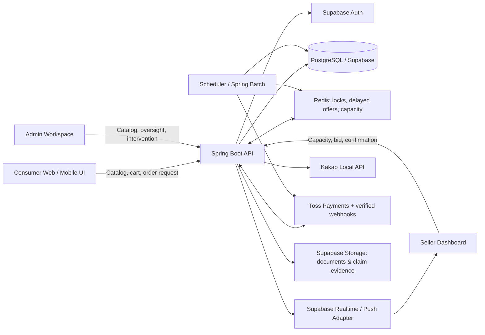

# Chulsoo-ya (철수야)

> **A hyper-local hardware commerce platform that turns a consumer cart into one accountable, real-time local fulfillment match.**

[](#) [](README.ko.md)

Chulsoo-ya is an O2O marketplace for consumers, business purchasers, public-sector purchasers, and local hardware stores. Consumers select items from a centrally managed catalog and submit a location-based order request. Eligible stores in the same administrative district (`gu_code`) receive a controlled real-time offer, and one store accepts responsibility for fulfilling the assigned order unit through delivery or pickup.

---

## 1. Product Rules That Govern Every Implementation

| Rule | Product decision | Implementation consequence |
| :--- | :--- | :--- |
| **Catalog ownership** | Products, prices, categories, and images are centrally managed by administrators. Sellers do not pre-register store inventory. | Consumer catalog APIs must be separate from seller capacity and bidding APIs. |
| **Fulfillment accountability** | A seller must fulfill every item in the order unit it bids on. A seller cannot place a partial bid for only some assigned items. | A winning bid is created only for the complete assigned unit. Any future split-order policy must create separate order units before bidding. |
| **Regional eligibility** | Matching is restricted by the delivery/pickup district represented by `gu_code`. | Address normalization through Kakao Local API is completed before an order enters the matching queue. |
| **Time authority** | The server is the sole authority for matching, offer, and confirmation deadlines. | Client-side countdowns are visual aids only; every API action validates server timestamps. |
| **Matching window** | An order waits for a match for up to **5 minutes**. A successful seller then has **2 minutes** to confirm item availability. | Store `match_deadline_at` and `seller_confirmation_deadline_at` on the order; deadline jobs enforce both fields. |
| **Payment sequence** | Payment capture occurs only after the winning seller has completed the item-confirmation step; delivery or pickup cannot begin before a successful payment state. | Separate order, payment, and settlement state machines. A pre-authorization, if later introduced, must be a separate provider state—not `PAID`. |
| **Claim protection** | A return, exchange, or partial replacement request pauses affected settlement funds. | Creating a claim atomically changes the settlement to `HOLD` and records an immutable claim timeline. |

---

## 2. Service Roles and Primary Journeys

| Role | Primary goal | Core journey |
| :--- | :--- | :--- |
| **Consumer** | Find required hardware without calling multiple stores. | Set address → browse catalog → manage cart → request order → wait for match → pay after seller confirmation → track delivery/pickup → review or raise a claim. |
| **Business / public purchaser** | Place auditable procurement orders. | Use the consumer flow with organization and document information → download quote, transaction statement, tax invoice, or receipt as permitted. |
| **Seller** | Receive only an operationally manageable amount of local demand. | Set available capacity → receive time-bound offers → bid → confirm availability within 2 minutes → fulfill → manage documents, claims, and performance. |
| **Administrator** | Control catalog quality, verify sellers, and preserve marketplace reliability. | Maintain catalog → review seller verification → monitor matching/capacity → mediate claims → administer penalties, settlement, coupons, and reports. |

---

## 3. Frontend Information Architecture and UI/UX Layout

The frontend is **mobile-first** because urgent hardware purchases and seller responses are expected to occur on a phone. Desktop layouts use the same content hierarchy with expanded navigation and multi-column panels; they do not create different business flows.

### 3.1 Shared Visual System

| Element | Rule |
| :--- | :--- |
| **Visual direction** | Use a calm neutral surface with restrained pastel accents. Trust, availability, and deadline status must remain more visually prominent than decorative imagery. |
| **Color semantics** | Primary action: blue; available/success: green; pending/deadline: amber; failed/restricted/danger: red. Status may never be communicated by color alone. |
| **Typography and density** | Use a Korean-optimized sans-serif stack, a 16 px or larger body baseline on mobile, and concise action labels. Show prices, quantities, and time limits in tabular numerals where possible. |
| **Responsive breakpoints** | Mobile: 1-column and fixed bottom navigation; tablet: 2-column content where useful; desktop: persistent side navigation or multi-panel dashboards. |
| **Accessibility** | Keyboard-operable controls, visible focus states, text labels for icon buttons, semantic headings, form errors connected to inputs, and a minimum 44 × 44 px mobile touch target. |
| **Realtime feedback** | Connection state, request in progress, deadline, success, failure, and retry actions are explicit UI states. Never imply that a bid, payment, or claim succeeded before the server confirms it. |

### 3.2 Consumer Main Page

The main page is the consumer's fastest route from a location to a valid cart. It must **not** present sellers as traditional inventory listings because catalog ownership is centralized and store stock is confirmed only when a seller bids.

| Layout zone | Desktop layout | Mobile layout | Required interaction |
| :--- | :--- | :--- | :--- |
| **Global header** | Brand, address selector, catalog search, cart badge, authentication/profile actions. | Compact brand bar with address and cart; search opens as a dedicated field or sheet. | Address change refreshes `gu_code` before checkout is enabled. |
| **Hero / request entry** | Wide value statement, prominent catalog search, and location confirmation panel. | Top card with the same search and location controls; no large decorative block that delays ordering. | Search routes to catalog results; location request has permission, manual-entry, and error states. |
| **Category navigator** | Horizontal category strip or grid beneath hero. | Swipeable chips or a 2–4 column icon grid. | Selecting a category preserves the active district and opens filtered catalog results. |
| **Product discovery** | Responsive product card grid with image, name, specification summary, price, quantity control, and add-to-cart action. | Two-column card grid; quantity changes are deliberate and readable. | Add to cart provides immediate feedback and updates the persistent cart badge. |
| **Order confidence panel** | Explains the sequence: request → local store match → confirmation → payment → delivery/pickup. | Compact three-step panel below the primary discovery area. | Links to matching policy and order guidance. |
| **Footer** | Service navigation, policy links, and support/legal information supplied by operations. | Collapsed links above bottom navigation. | Must not compete with the cart or checkout CTA. |

**Consumer bottom navigation:** `Home` · `Categories` · `Cart` · `Orders` · `My`.

### 3.3 Consumer Transaction Screens

| Screen | Essential UI elements | Non-negotiable behavior |
| :--- | :--- | :--- |
| **Catalog / search results** | Search field, category and specification filters, sort, product cards, empty state. | Catalog availability is not represented as store-specific stock. |
| **Product detail** | Product image, standardized details, price, quantity selector, related category navigation, add-to-cart CTA. | A quantity change updates cart state safely and shows validation feedback. |
| **Cart** | Editable line items, subtotal, delivery/pickup choice, address, coupon selection, document profile, and primary `Request Matching` CTA. | Checkout is blocked until address, quantities, and required purchaser data are valid. |
| **Matching wait** | Server-synchronized 5-minute countdown, matching status, selected delivery/pickup method, and support path. | Timer resumes from server timestamps after reload; it never resets from device time. |
| **Seller confirmation wait** | Acknowledge that a store accepted the request and display the remaining confirmation time. | On rejection or timeout, transition to accelerated re-bidding or `MATCH_FAILED` guidance without false success messaging. |
| **Payment** | Final order summary, payment method, coupon effect, consent, and payment progress state. | Payment is initiated only after seller confirmation; duplicate submission is prevented by an idempotency key. |
| **Order detail / claim** | Fulfillment timeline, document links, claim CTA, claim evidence upload, and claim history. | A claim explains its settlement-hold effect before submission and shows server-confirmed status. |

### 3.4 Seller Dashboard

The seller dashboard prioritizes operational control over marketing content. Its first screen must answer: **Can I receive work now, and what requires action first?**

| Dashboard zone | Required content | Interaction rule |
| :--- | :--- | :--- |
| **Availability command bar** | Receiving status, configured capacity, `reserved + active / configured` slot usage, remaining capacity, and a one-tap **Busy mode**. | Busy mode immediately sets configured capacity to `0` through a server-confirmed action. |
| **Quick slot control** | Slider or stepper for capacity, bounded by the subscription tier cap: Premium `1–15`, Standard `1–8`, Free/New `1–3`. | Every mutation creates a `StoreSlotSettingsLog`; UI displays pending/error confirmation. |
| **Live offer queue** | Grouped new-order offers, expiration countdown, order-unit summary, delivery/pickup information, bid CTA, and decline action. | The CTA is disabled after expiry or successful winning bid; the server—not the button—decides the winner. |
| **Confirmation workspace** | Won bid detail, 2-minute availability-confirmation countdown, fulfilment method, and confirm/cannot-fulfil actions. | A failed or late confirmation triggers the defined recovery and penalty path. |
| **Active fulfillment** | Preparing, delivery/pickup-ready, in-transit, completed orders; customer-safe contact/actions. | Status changes are recorded as order events and require valid state transitions. |
| **Claims and documents** | Unread claim count, claim quick actions, settlement hold status, and document downloads. | Refund, resend, pickup instruction, or rejection requires a server-side authorization and audit event. |
| **Operations insight** | Slot-full count, missed-order count, bid response time, match success rate, and delivery compliance. | Metrics are read-only derived values; they cannot be edited in the client. |

### 3.5 Administrator Workspace

Use a desktop-first administration layout with persistent left navigation and contextual main panels. The dashboard must cover catalog, seller verification, live matching, capacity overrides, claims, settlements, coupons, penalties, and audit logs. Store detail pages show slot status, slot-setting history, missed offers, order lifecycle timeline, response speed, claim rate, and authorized administrative actions such as force-setting capacity to zero.

### 3.6 Mandatory UI States

Every route and critical component must define **loading**, **empty**, **error**, **offline/reconnecting**, **permission denied**, **expired**, and **success** states. Realtime screens additionally display connection health and last server update time. A disabled action must explain why it is unavailable; it must not silently disappear.

---

## 4. Frontend Module Boundaries

The connected repository currently contains the default Vite starter screen in `client/src/App.tsx`; it is not product UI and must be replaced before feature work is considered complete.

```text
client/
└── src/
    ├── app/                 # App shell, routing, providers, route guards
    ├── components/          # Reusable UI primitives and composed shared components
    ├── features/
    │   ├── catalog/         # Categories, search, product detail
    │   ├── cart/            # Cart and cart-item state
    │   ├── checkout/        # Address, purchaser profile, matching request, payment
    │   ├── matching/        # Realtime matching and deadline UI
    │   ├── orders/          # Consumer order tracking and claims
    │   ├── seller/          # Capacity, offers, confirmation, fulfilment, metrics
    │   └── admin/           # Catalog, verification, governance, reporting
    ├── services/            # Typed API client, Supabase realtime adapter, auth adapter
    ├── hooks/               # Reusable domain-aware hooks
    ├── styles/              # Tokens, global styles, responsive utilities
    └── types/               # Shared client contracts; generated contracts are preferred
```

Route guards enforce `CONSUMER`, `SELLER`, and `ADMIN` roles. Business decisions remain on the server; the frontend renders state, collects valid input, and subscribes to approved realtime events.

---

## 5. Backend and Realtime Architecture



| Layer | Responsibility |
| :--- | :--- |
| **React + TypeScript client** | Role-based UI, responsive layouts, cart state, server-state rendering, and realtime subscriptions. |
| **Spring Boot API** | Authorization, domain state transitions, matching orchestration, payment/claim workflows, and audit logging. |
| **PostgreSQL / Supabase** | Durable transactional state, row-level access policy, and immutable operational history. |
| **Redis** | Order-level distributed locks, delayed offer dispatch, capacity reservation, and idempotency/retry coordination. |
| **Supabase Realtime / push adapter** | Delivers approved domain events to seller and consumer screens; it never becomes the source of truth. |

---

## 6. Core Data Model and Invariants

### 6.1 Core Domains

| Domain / table | Purpose | Essential fields and relationships |
| :--- | :--- | :--- |
| **Users** | Unified identity and role. | `id`, `email`, `role`, profile fields. Roles: `CONSUMER`, `SELLER`, `ADMIN`. |
| **Stores** | Verified seller profile and matching eligibility. | `user_id`, `gu_code`, verification status, subscription tier, `tier_slot_cap`, `configured_slots`, `reserved_slots`, `active_slots`, `restricted_until`, `is_receiving_orders`. |
| **Store_Slot_Settings_Logs** | Immutable capacity-change audit trail. | `store_id`, `old_configured_slots`, `new_configured_slots`, `changed_by`, `reason`, `created_at`. |
| **Missed_Orders_Logs** | Records opportunity loss such as full capacity. | `store_id`, `order_id`, `reason` such as `SLOT_FULL`, `created_at`. |
| **Products / Categories** | Central administrator-owned catalog. | `product_id`, category, standardized specification, price, image, active flag. |
| **Carts / Cart_Items** | Consumer demand staging before an order exists. | `Carts.consumer_id`; `Cart_Items.cart_id`, `product_id`, `quantity`, selected option data. |
| **Orders / Order_Items** | Purchase request and immutable price snapshot. | `consumer_id`, `gu_code`, deadlines, delivery method, status; item `price_at_order`, quantity, assigned match unit. |
| **Match_Offers** | A time-bound notification/reservation sent to an eligible store. | `order_id`, `store_id`, tier, `offered_at`, `expires_at`, status. Tracks a reserved capacity slot separately from a winning bid. |
| **Bids** | Seller response and winning assignment. | `order_id`, `store_id`, `status`, `is_winner`, `created_at`, confirmation timestamps. |
| **Payments / Refunds** | Provider transaction and cancellation/refund history. | provider key, `amount`, `remaining_amount`, status, `idempotency_key`; refund amount, reason, provider response. |
| **Claims / Claim_Items / Claim_Attachments** | Return, exchange, and partial-replacement workflow. | request type, status, evidence, requested item quantities, resolution and timeline. |
| **Settlements** | Seller pay-out lifecycle. | `order_id`, `store_id`, amounts, delivery fee, platform fee, `status` including `HOLD`. |
| **Documents** | Generated legal and transaction documents. | `order_id`, document type, storage object key, access policy, issued time. |
| **Notifications** | User preferences and delivery history. | `user_id`, type, channel, payload reference, sent/read/failed timestamps. |
| **Penalties / Reviews / Coupons / User_Coupons** | Marketplace trust, feedback, and compensation. | Violation level/expiry; verified review; coupon terms and ownership lifecycle. |

### 6.2 Capacity and Matching Invariant

Capacity must not use one ambiguous counter. The following model is authoritative:

```text
available_slots = configured_slots - reserved_slots - active_slots
0 <= configured_slots <= tier_slot_cap
reserved_slots >= 0
active_slots >= 0
available_slots >= 0
```

| Event | `reserved_slots` | `active_slots` | Required result |
| :--- | :---: | :---: | :--- |
| Matching offer sent | +1 | — | Create `Match_Offer` with expiry only when capacity is available. |
| Offer declined or expires | -1 | — | Mark offer closed; release capacity immediately. |
| Bid wins | -1 | +1 | Atomically convert reserved capacity into active fulfillment capacity. |
| Seller cannot fulfil / confirmation expires | — | -1 | Start accelerated re-bidding and apply the policy-defined penalty path. |
| Order completes, cancels, or is resolved | — | -1 | Release active capacity exactly once. |

**Required database constraints and transaction rules**

```sql
-- A consumer has at most one active cart.
CREATE UNIQUE INDEX ux_carts_one_active_per_consumer
ON carts (consumer_id) WHERE is_active = true;

-- A product/option combination appears once per cart.
CREATE UNIQUE INDEX ux_cart_items_unique_product_option
ON cart_items (cart_id, product_id, option_hash);

-- Multiple bids may exist, but an order can have exactly one winning seller.
CREATE UNIQUE INDEX ux_bids_one_winner_per_order
ON bids (order_id) WHERE is_winner = true;

-- Provider retries must not create a second payment operation.
CREATE UNIQUE INDEX ux_payments_idempotency_key
ON payments (idempotency_key);
```

The winning-bid transaction acquires an order-level distributed lock, verifies that the order is still `WAITING_MATCH`, creates the winner, updates the order, and updates the seller capacity in one protected operation. Redis improves coordination; PostgreSQL constraints remain the final integrity boundary.

### 6.3 State Machines

| Aggregate | Allowed primary progression | Notes |
| :--- | :--- | :--- |
| **Order** | `DRAFT` → `WAITING_MATCH` → `MATCHED` → `SELLER_CONFIRMING` → `PAYMENT_PENDING` → `PAID` → `PREPARING` → `DELIVERY_IN_PROGRESS` or `PICKUP_READY` → `COMPLETED` | Alternate terminal/recovery states: `MATCH_FAILED`, `CANCELLED`, `RE_MATCHING`. A claim is represented by the claim aggregate and settlement hold, not an untracked UI flag. |
| **Payment** | `READY` → `PAID` → `CANCEL_PENDING` → `CANCELLED`; or `PAID` → `REFUNDING` → `PARTIAL_REFUNDED` / `REFUNDED` | Provider webhooks are verified and persisted before final state updates. |
| **Claim** | `REQUESTED` → `SELLER_REVIEW` → `PICKUP_IN_PROGRESS` / `RESEND_IN_PROGRESS` → `RESOLVED` | `REJECTED` requires a reason and audit record. Claim creation places settlement on `HOLD`. |
| **Match offer** | `SENT` → `DECLINED` / `EXPIRED` / `BID_SUBMITTED` | An expired offer cannot create a valid bid. |

---

## 7. Scheduler and Event Processing Specification

Immediate user actions—winning a bid, reserving/releasing a slot, creating a claim hold, and recording a payment webhook—are handled synchronously in domain transactions. Schedulers are the **deadline, reconciliation, and recovery safety net**, not a substitute for transactional rules.

All schedules use **`Asia/Seoul`**, server timestamps, idempotent job keys, pagination/`SKIP LOCKED` or equivalent lease control, structured job logs, and retry with a bounded backoff policy.

| Job | Baseline schedule | Inputs and action | Idempotency / observability requirement |
| :--- | :--- | :--- | :--- |
| **Match offer expiry** | Every 10 seconds | Finds `Match_Offers` past `expires_at`; marks them expired and releases only their reservation. | Lock by offer ID; log released slot count and latency. |
| **Initial matching deadline** | Every 30 seconds | Finds `WAITING_MATCH` orders past `match_deadline_at` (5 minutes); moves them to `MATCH_FAILED` and presents reservation/re-notification options. | Lock by order ID; never silently cancel a paid order. |
| **Seller confirmation deadline** | Every 10 seconds | Finds winners past the 2-minute confirmation deadline; releases active capacity, records the policy outcome, and starts accelerated re-bidding. | One recovery event per order attempt; audit the prior winner. |
| **Penalty recovery sweep** | Every 1 minute | Detects missed deadline transitions after job or network failure and creates any missing penalty record. | `order_id + violation_type` must be unique for the same incident. |
| **Payment reconciliation** | Every 5 minutes | Re-checks payment/refund attempts in an indeterminate state after timeout or webhook failure against the payment provider. | Reuses the provider transaction key; stores request/response audit data. |
| **Settlement eligibility** | Daily at 02:00 | Selects completed orders with no open claim and releases eligible settlement from `HOLD` to payable status. | Settlement run ID, per-order outcome, and rerunnable transaction boundary. |
| **Coupon lifecycle** | Daily at 09:00 | Expires due coupons and sends configured pre-expiry notices for active coupons. | Never re-send the same notice type for the same coupon period. |
| **Trust-score refresh** | Every Monday at 03:00 | Recalculates seller trust scores from finalized delivery, cancellation, claim, and penalty data. | Version score inputs; preserve the prior score and calculation timestamp. |
| **Document generation retry** | Every 15 minutes | Retries failed document generation for completed, eligible transaction events. | Unique `order_id + document_type`; never overwrite a valid issued document. |

---

## 8. Development Roadmap and Delivery Gates

| Phase | Scope | Frontend deliverable | Backend / data deliverable | Exit gate |
| :--- | :--- | :--- | :--- | :--- |
| **0. Product foundation** | Confirm product rules, state machines, API contracts, UI tokens, and responsive route map. | App shell, route map, design tokens, shared loading/error/empty components. | ERD, migration plan, API error convention, audit/event convention. | No conflicting state or payment sequence remains. |
| **1. Identity and catalog** | Authentication, role boundaries, seller verification, and administrator catalog. | Auth flow, protected layouts, category/search/product UI. | Users, stores, products, categories, RLS, NTS verification workflow. | A verified seller and a consumer see only authorized routes/data. |
| **2. Consumer commerce** | Main page, catalog, cart, address normalization, and order request. | Complete consumer main page and cart/checkout validation flow. | Carts, order drafts/items, Kakao address-to-`gu_code` adapter. | A valid cart becomes one correctly scoped `WAITING_MATCH` order. |
| **3. Matching and seller operations** | Tier dispatch, capacity, bidding, confirmation, and realtime UI. | Seller dashboard, quick slot control, offer queue, confirmation screen, consumer matching timeline. | Offers, bids, Redis locks/delayed dispatch, capacity accounting, deadline jobs. | Concurrent bids yield one winner; every capacity counter balances. |
| **4. Payment and documents** | Payment, cancellation/refund, and generated documents. | Payment progress, receipt/document access, clear failure/retry states. | Toss adapter/webhooks, idempotency, payments/refunds, documents/storage policies. | Provider and internal states reconcile for success, timeout, retry, and refund cases. |
| **5. Claims, settlement, and governance** | Claims, escrow hold, penalties, coupons, administration, and metrics. | Claim submission/resolution UI, seller operations insight, admin workspace. | Claims, settlements, penalties, coupons, scheduled governance jobs. | A claim holds settlement and produces a complete auditable timeline. |
| **6. Quality and release** | Security, accessibility, observability, performance, and deployment readiness. | Responsive visual QA and accessibility checks across consumer/seller/admin routes. | Unit/integration/load tests, monitoring, backups, migration rollback plan. | Critical flows pass acceptance tests under expected concurrent load. |

---

## 9. Technology Boundaries

| Layer | Chosen direction |
| :--- | :--- |
| **Frontend** | React + TypeScript + Vite, Tailwind CSS, typed API client, server-state query layer, Supabase realtime adapter. Node.js is required for local dependency management and the Vite build toolchain. |
| **Backend** | Spring Boot 3.x on Java 21, Spring Security, JPA/Querydsl, explicit domain services and transactions. |
| **Data and realtime** | Supabase PostgreSQL, Auth, Storage, and Realtime; Redis for locks, capacity coordination, and delayed processing. |
| **External services** | Kakao Local API for address normalization, Toss Payments for payment/refund webhook integration, and NTS business-verification API for seller onboarding. |
| **Document generation** | Server-side deterministic templates populated from transaction data; no AI generation is used for legal transaction documents. |

---

## 10. Engineering Standards

| Standard | Requirement |
| :--- | :--- |
| **Domain ownership** | Matching, capacity, payment, claim, settlement, and penalty logic live in explicit backend domains; UI components do not duplicate their decisions. |
| **Testing** | Write tests before or alongside every critical state transition. At minimum, cover concurrent bids, capacity reservation/release, timer expiry, payment webhook retry, partial refund, claim hold, and role authorization. |
| **Security** | Enforce role authorization on every API, use row-level storage/database controls, keep secrets in environment configuration, validate uploads by size/type/content, and verify payment webhook signatures. |
| **Auditability** | Preserve order, payment, claim, slot-change, and administrative-action timelines. Financial or governance state must never be changed without actor, time, reason, and correlation ID. |
| **Observability** | Emit structured logs and metrics for match latency, offer expiry, slot saturation, bid success, confirmation timeout, payment reconciliation, claim turnaround, and job failure. |
| **Mobile parity** | A future native app may reuse the API and shared contracts, but it must preserve the same domain states, deadline behavior, and authorization rules. |
