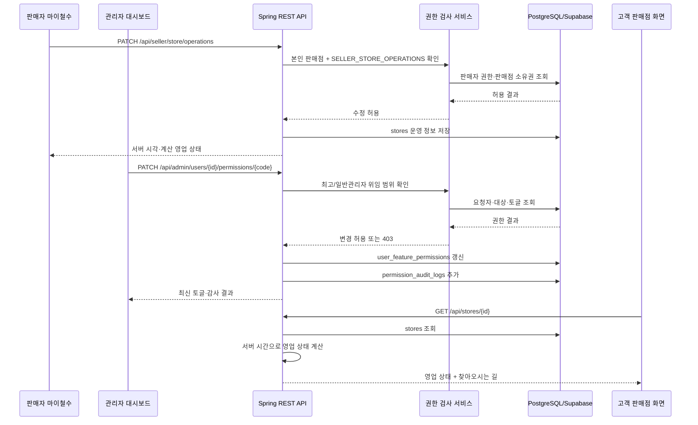

# 판매점 운영 정보·역할 권한 토글 계약

## 1. 변경 경계

| 구분 | 처리 원칙 |
|---|---|
| 회원 기본 주소·배송지 | 변경·대체·삭제하지 않는다. `users`, `delivery_addresses`, 회원정보·체크아웃 흐름은 본 기능의 수정 대상이 아니다. |
| 판매점 찾아오시는 길 | `stores`에 별도 안내 문구로 저장한다. 회원 기본 주소와 독립된 판매점 안내이며, 고객 상세 화면에만 추가 노출한다. |
| 영업 상태 | 서버의 `Asia/Seoul` 시간과 판매점 운영 설정으로 계산한다. 프론트엔드는 계산된 상태값만 표시한다. |
| 주문 수신·슬롯·매칭 | 기존 `receiving_orders`, 슬롯 회계, 응찰 자격·배분 로직은 영업 상태와 분리해 유지한다. 영업 상태 변경이 주문 수신 상태를 변경하지 않는다. |
| 권한 | 최고관리자는 모든 기능을 통과한다. 일반관리자·판매자·일반사용자는 DB에 저장된 허용 토글만 사용할 수 있다. |

## 2. 판매점 운영 정보 계약

### 2.1 `stores` 추가 컬럼

| 컬럼 | 형식 | 기본값 | 용도 |
|---|---|---:|---|
| `directions` | `varchar(500)` | `NULL` | 판매점 전용 찾아오시는 길 안내 |
| `business_open_time` | `time` | `09:00` | 서버 기준 영업 시작 시각 |
| `business_close_time` | `time` | `18:00` | 서버 기준 영업 종료 시각 |
| `weekly_closed_days` | `varchar(40)` | 빈 값 | `MON,TUE,...,SUN` 형식의 정기 휴무 요일 |
| `temporary_closed` | `boolean` | `false` | 판매자 또는 관리자 지정 임시 휴무 |

운영 시간은 시작 시각이 종료 시각보다 이른 당일 영업만 허용한다. 야간 영업은 현재 범위에서 지원하지 않는다.

### 2.2 서버 상태 계산

```text
임시 휴무 또는 정기 휴무일              → 휴무
영업 시작 시각 전                        → 준비중
영업 시작 시각 이상, 종료 시각 미만      → 영업중
영업 종료 시각 이후                      → 영업종료
```

서버는 `Clock`과 `Asia/Seoul`을 사용해 `StoreOperatingStatus`를 계산하고, 고객·판매자·관리자 응답에 영문 코드와 한글 표시용 값으로 제공한다. 고객 화면은 `영업중`, `준비중`, `영업종료`, `휴무` 외의 주문 수신 상태 문구를 표시하지 않는다.

### 2.3 운영 정보 REST 계약

| 주체 | 경로 | 동작 |
|---|---|---|
| 고객 | 기존 `GET /api/stores/**` | 계산된 영업 상태와 찾아오시는 길을 읽기 전용으로 수신 |
| 판매자 | `GET /api/seller/store` | 본인 판매점 운영 설정·서버 시각·계산 상태 조회 |
| 판매자 | `PATCH /api/seller/store/operations` | 찾아오시는 길, 시작·종료 시각, 정기 휴무, 임시 휴무 수정 |
| 관리자 | 기존 `POST/PATCH /api/admin/stores/**` 확장 | 판매점 운영 설정을 CRUD. 일반관리자는 `ADMIN_MANAGE_STORES`가 있어야 한다. |

판매자 화면은 제한된 `time` 입력과 요일 체크만 제공하며, 브라우저 시간으로 상태를 판정하지 않는다. 항상 응답의 서버 시각과 계산 상태를 표시한다.

## 3. 역할·권한 토글 계약

### 3.1 역할의 기본 원칙

| 역할 | 권한 원칙 |
|---|---|
| 최고관리자 | 모든 기능·모든 권한 토글을 조회·변경한다. DB 토글이 없어도 전체 통과한다. |
| 일반관리자 | 최고관리자가 부여한 `ADMIN_*` 토글만 사용한다. 최고관리자용 토글과 다른 관리자 계정의 관리자 권한은 조회·변경하지 못한다. |
| 판매자 | 일반사용자 기능을 함께 가진다. 본인 판매점의 허용된 판매자 기능만 사용하며 권한 토글 UI는 없다. |
| 일반사용자 | 허용된 일반사용자 기능만 사용하며 권한 토글 UI는 없다. |

### 3.2 권한 코드

| 그룹 | 코드 | 기능 |
|---|---|---|
| 일반사용자 | `CONSUMER_PURCHASE` | 장바구니·주문 요청·결제 흐름 |
| 일반사용자 | `CONSUMER_REVIEW` | 거래 후기 작성 |
| 일반사용자 | `CONSUMER_SUPPORT` | 고객 문의 등록 |
| 일반사용자 | `CONSUMER_SELLER_APPLICATION` | 판매자 등록·해지 신청 |
| 판매자 | `SELLER_STORE_OPERATIONS` | 본인 판매점 운영 정보·찾아오시는 길·영업시간 설정 |
| 판매자 | `SELLER_CATALOG` | 본인 상품 관리 |
| 판매자 | `SELLER_BID_AND_FULFILLMENT` | 응찰·물품 확인·배달 시작·완료 |
| 판매자 | `SELLER_SUBSCRIPTION` | 구독 조회·신청 |
| 판매자 | `SELLER_CLAIM_RESPONSE` | 낙찰 주문의 클레임 처리 |
| 일반관리자 | `ADMIN_MANAGE_CONSUMERS` | 일반사용자 계정과 일반사용자 기능 토글 관리 |
| 일반관리자 | `ADMIN_MANAGE_SELLERS` | 판매자 계정·판매자 기능 토글·해지 요청 관리 |
| 일반관리자 | `ADMIN_MANAGE_STORES` | 판매점 운영 정보·찾아오시는 길·영업시간 CRUD |
| 일반관리자 | `ADMIN_REVIEW_SELLER_APPLICATIONS` | 판매자 신청 심사 |
| 일반관리자 | `ADMIN_MANAGE_CATALOG` | 상품·카테고리 관리 |
| 일반관리자 | `ADMIN_MANAGE_EVENTS_AND_COUPONS` | 행사·이벤트·쿠폰 관리 |
| 일반관리자 | `ADMIN_MANAGE_SUBSCRIPTIONS` | 판매자 구독 등급 관리 |
| 일반관리자 | `ADMIN_VIEW_MATCHING` | 주문 응찰 모니터링 조회 |
| 일반관리자 | `ADMIN_MANAGE_SETTLEMENTS` | 정산·환불 관리 |
| 일반관리자 | `ADMIN_MANAGE_SUPPORT` | 고객 문의 관리 |
| 일반관리자 | `ADMIN_APPROVE_DEVELOPMENT_PAYMENTS` | 개발 결제 승인 |

판매자는 일반사용자 기능 토글과 판매자 기능 토글을 함께 가질 수 있다. 기존에 동작 중인 역할 기능을 중단하지 않기 위해 마이그레이션은 현 역할에 맞는 기능 토글을 기본 `ON`으로 생성한다. 최고관리자는 이후 행 단위 토글로 변경할 수 있다.

### 3.3 저장·감사 모델

| 테이블 | 핵심 필드 | 제약 |
|---|---|---|
| `user_feature_permissions` | `user_id`, `permission_code`, `enabled`, `updated_by`, `updated_at` | `(user_id, permission_code)` 유니크. 판매자에게는 일반사용자·판매자 코드만 허용. |
| `permission_audit_logs` | `actor_user_id`, `target_user_id`, `permission_code`, `previous_enabled`, `next_enabled`, `created_at` | 변경 전후 값과 주체를 append-only 기록. |

일반관리자의 `ADMIN_*` 권한도 위 테이블에 저장한다. 최고관리자는 토글 변경 시 항상 감사 이력을 남긴다. 일반관리자는 자신·다른 관리자·최고관리자의 `ADMIN_*` 토글을 변경할 수 없고, 본인에게 부여된 `ADMIN_MANAGE_CONSUMERS` 또는 `ADMIN_MANAGE_SELLERS` 범위에서만 일반사용자·판매자 기능 토글을 변경할 수 있다.

## 4. 회원관리 토글 UI 계약

회원관리에서 회원 행을 클릭하면 해당 행 바로 아래에 권한 설정 패널을 연다.

| 대상 역할 | 최고관리자 표시 | 일반관리자 표시 |
|---|---|---|
| 일반사용자 | 일반사용자 기능 토글 전체 | 본인에게 `ADMIN_MANAGE_CONSUMERS`가 있을 때 일반사용자 토글만 표시 |
| 판매자 | 일반사용자 + 판매자 기능 토글 전체 | 본인에게 `ADMIN_MANAGE_SELLERS`가 있을 때 일반사용자 + 판매자 토글만 표시 |
| 일반관리자 | 일반관리자 기능 토글 전체 | 표시·수정 불가 |
| 최고관리자 | 상태 정보만 표시, 권한 토글 변경 불가 | 표시·수정 불가 |

권한 변경 요청은 서버에서 대상 역할, 요청자 등급, 요청자 보유 권한, 자기 권한 변경 여부를 다시 검증한다. UI 숨김만으로 권한을 보호하지 않는다.

## 5. 통신 흐름



## 6. 파일 소유권·구현 순서

| 역할 | 소유 범위 | 선행 조건 |
|---|---|---|
| 설계·통합 | 이 계약, 통신 흐름, 공통 API 코드 목록 | 없음 |
| 백엔드·DB | `domain/store/**`, `domain/user/**`, Flyway V36+, 관련 서버 테스트 | 계약 확정 |
| 프론트엔드 | `features/seller/**`, `features/stores/**`, `features/admin/**`, `api/endpoints.ts`, `types/api.ts` | 백엔드 DTO·REST 계약 확정 |
| QA | 역할별 E2E 시나리오·회귀 기록 | 구현 핸드오프 |
| 보안 검토 | 권한 우회·수평/수직 승격·감사 이력 점검 | 백엔드 구현 핸드오프 |

## 7. 수용 기준

1. 회원 기본 주소와 배송지 API·테이블은 이 기능으로 변경되지 않는다.
2. 고객은 서버가 계산한 네 가지 영업 상태와 판매점 전용 찾아오시는 길만 본다.
3. 영업시간·휴무 변경은 기존 주문 수신·슬롯·매칭 상태를 바꾸지 않는다.
4. 판매자와 권한을 가진 관리자는 별도 판매점 운영 정보를 CRUD할 수 있다.
5. 최고관리자는 모든 토글을 관리하고, 일반관리자는 자신에게 허용된 기능과 대상 역할 범위만 관리한다.
6. 일반관리자는 관리자 권한·최고관리자 정보·자기 권한을 변경할 수 없다.
7. 모든 토글 변경은 DB 감사 이력에 저장된다.
8. 기존 판매자·일반사용자의 현재 기능은 마이그레이션 기본 토글로 유지된다.
